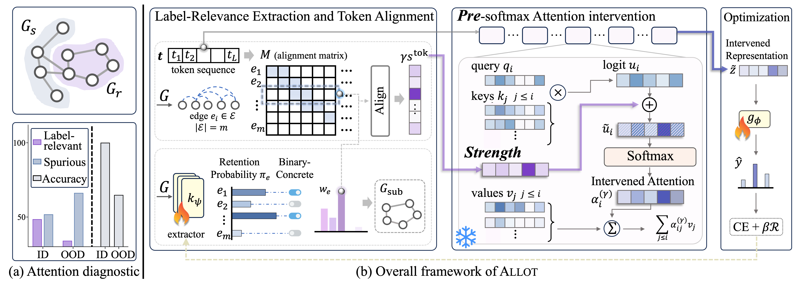

# ALLOT_Attention_Intervention

# **Allot**
LLM Attention Intervention for Graph OOD Generalization

## Project Overview
`Abstract` Large language models (LLMs) exhibit promising graph understanding, with pretraining-induced inductive biases guiding attention-weighted aggregation over structure information. Despite their broad generalizability, LLMs' performance still degrades substantially in graph out-of-distribution (OOD) scenarios. Through attention diagnostics, we identify this degradation is associated with a shift in attention allocation toward spurious substructures. Accordingly, **attention intervention** represents an LLM-tuning-free approach to improve graph OOD generalization. Its effectiveness, however, depends critically on *where* and *how strongly* to intervene. To address these issues, we propose **Allot**, a label relevance guided attention intervention, which theoretically characterizes the stronger modulation capacity of pre-softmax intervention, reducing the strength for attention restoration from $O(1/\varepsilon)$ to $O(\log(1/\varepsilon))$ for an initial attention ratio $\varepsilon$. Building on the fidelity bound, we further derive a closed-form sufficient scale threshold for intervention strength. Extensive experiments demonstrate **Allot**'s superiority, improving average OOD accuracy over 8 LLMs by $12.41-28.23\%$.

